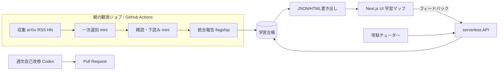

# Astrolabe(仮称) — LLM/AI学習観測エージェント 設計書 v0.1

- 作成日: 2026-07-18
- 記録: 蒼星リセ(壁打ち相手・記録係) / 施主: Seiya
- 位置づけ: これまでの壁打ちで合意した事項の固定化。未決事項は §12 に隔離する。
- 仮称 Astrolabe(アストロラーベ)は観測・航法用の古典的な計器から。気に入らなければ №12 で改名すること。

---

## 1. 目的と全体像

LLM/AIエージェント領域を学ぶ個人のために、次の三つの機能を一つの学習記録の上に載せたアプリを作る。

1. **朝の観測報告(定期実行型)** — 毎朝、arXiv・RSS・ニュースを巡回し、今知るべきトピック数件と、それぞれに対する短い学習コンテンツを届ける。
2. **常駐チューター(対話型)** — 基礎知識の穴を埋めるためのタスク管理と面談。話しかけると動く。
3. **学習マップ(トップ画面)** — これまでに学んだ概念とそのつながりを毎朝再描画し、昨日からの差分を一文で添える。成長が目に見えることが継続の核。

ループ構造: 提案 → 選択 → 学習 → 記録 → マップ更新 → 提案精度の向上。

副次目的が二つある。第一に、独自UIまで含めた**ポートフォリオ**であること。第二に、開発それ自体が学習教材であること。常駐チューターが出す学習タスクに本アプリの改修タスクを含めることで、学習と開発を一つの循環にする(§6.3)。

## 2. 設計原則

1. **背骨は一本。** 三機能はすべて単一の学習台帳(§4)を読み書きする導出物として作る。機能ごとに独立のデータを持たせない。
2. **LLMはデータを作り、描画はコードが行う。** モデルの出力は台帳への差分(JSON)と短い文章まで。HTMLとマップはテンプレートとクライアントJSが引き受け、実行時の描画トークンはゼロにする。
3. **各マイルストーンで常に使える状態を保つ。** UIの完成を待たず、二日目から価値が出る順に作る(§9)。
4. **予算は役割で分ける。** 実行時の推論はAPI無料枠、コードを書く仕事はCodex(ChatGPT Pro枠)、描画は無料(§8)。
5. **データ共有を前提に題材を選ぶ。** API無料枠はデータ共有プログラムの対価であり、送った内容は学習に使われる。台帳に入れてよいのは公開情報と、共有を許容すると明示的に決めた学習履歴・興味プロファイルのみ。私信・成績・生活情報は入れない。

## 3. アーキテクチャ

- エージェント核: **Python**(LLM研究・論文実装の主流言語であり、学習対象と重なるため)
- UI: **Next.js**(独自UI。ポートフォリオの顔)
- 定期実行: **GitHub Actions** のスケジュール実行
- 常駐バックエンド: **サーバレス関数**(Vercel。APIキーを秘匿するための最小の常時窓口)



### リポジトリ構成

| リポジトリ | 公開 | 内容 |
|---|---|---|
| `astrolabe-core` | public | Python。収集・選別・統合・台帳導出・エクスポート |
| `astrolabe-ui` | public | Next.js。マップ、報告ページ、タスク画面 |
| `astrolabe-ledger` | **private** | 学習台帳の実データ(君の学習履歴)。仕組みは見せ、記録は見せない |

台帳ストレージは段階制にする。M0〜M2 は private リポジトリへの SQLite/JSONL コミット(無料・履歴が残る・運用ゼロ)。常駐チューターが書き込みを始める M3 で Supabase(無料枠)へ移行する。サーバレス関数からの書き込みが素直になるため。

## 4. 学習台帳スキーマ

原則: **events が一次データ(追記のみ)。他のテーブルはイベントから再導出可能**であること。導出をやり直せる限り、スキーマ変更を恐れなくてよい。

```sql
-- 一次データ: 起きたことの記録(追記のみ)
events(
  id, ts,
  type,        -- proposed / selected / dismissed / marked_known /
               -- task_created / task_done / quiz_result / interview / chat_note
  concept_id,  -- 対象概念(任意)
  payload      -- JSON: スコア、選択理由、クイズ結果など
)

-- 導出: 概念(マップのノード)
concepts(
  id, name,
  kind,        -- concept / paper / tool / event
  status,      -- unknown / queued / learning / learned / review
  confidence,  -- 0..1 理解度の推定
  summary, source_urls, first_seen, last_touched
)

-- 導出: つながり(マップのエッジ)
edges(
  src, dst,
  type,        -- prerequisite / related / derived_from / appeared_in
  weight, created_by, created_at
)

-- タスク(常駐チューターの管理対象)
tasks(
  id, concept_id, title,
  kind,        -- read / implement / quiz / build_app_feature
  status, est_minutes, evidence, created_at, done_at
)

-- 学習者プロファイル(単一レコード)
profile(
  interests,   -- タグ+重み。時間減衰し、選択で強化される
  goals, background, time_budget
)

-- 朝の報告のアーカイブ
daily_reports(date, items, map_delta_text, html_path)
```

## 5. パーソナライズ設計

### 5.1 二軸を混同しない

選択という信号には興味と既知の二つの意味が混ざるため、フィードバックは安い操作で分離して取る。

| 操作 | 興味軸 | 知識軸 | 台帳イベント |
|---|---|---|---|
| 学ぶ(選択) | + | 学習開始 | selected |
| 気になる(保留) | + | 変化なし | selected(payload: later) |
| もう知っている | 変化なし | learned登録 | marked_known |
| 興味がない | − | 変化なし | dismissed |

### 5.2 提案のランキング規準

新規性 × 興味適合(interests) × 学習価値 − 既知ペナルティ。学習価値は前提充足度で測る: 前提となる概念がほぼ埋まっている未知トピックを優先する。基礎が欠けたまま最先端だけ追う提案にならないための項。

### 5.3 コールドスタート

初週はプロファイルが空で提案の質が出ない。対策として、**初回面談**を最初の入力にする。M3の常駐チューター完成前は、CLIの質問スクリプトで代替する(現在地・目標・既知概念の一括登録 → profile初期化 + marked_knownイベント一括投入)。

## 6. ジョブ設計

### 6.1 朝の観測ジョブ(毎日 06:30 JST = 前日 21:30 UTC)

パイプライン(すべて構造化出力・JSON Schema指定で受ける):

1. **収集** — arXiv API(cs.CL / cs.AI / cs.LG、礼儀として3秒間隔)、RSS数本、Hacker News上位。1日およそ300〜600件。
2. **重複排除** — タイトル正規化 + 既出判定。embeddingsは無料枠対象外の可能性があるため(§11)、初期は使わず、使う場合も実費は月数十円規模。
3. **一次選別(mini)** — 要旨とプロファイルを渡してスコアリング。
4. **精読・下読み(mini)** — 上位5〜10本の本文を要点抽出。
5. **統合報告(flagship)** — 知るべきトピック3〜5件、各10分程度の学習コンテンツ、マップ差分の一文を生成。
6. **台帳更新・書き出し** — events追記 → concepts/edges再導出 → JSON/HTMLエクスポート → 通知(チャネルは§12)。

タイミング補足: 無料枠は 00:00 UTC(09:00 JST)にリセットされる。06:30 JSTの実行は前日枠の残りを使う計算になり、日中のチューター利用と同じ枠を取り合わない。

### 6.2 トークン見積(1日あたり)

| 工程 | モデル | 見積 | 根拠 |
|---|---|---|---|
| 一次選別 | mini | 約0.18M | 500件 × (入力300 + 出力60) |
| 重複排除補助 | mini | 約0.10M | 予備 |
| 精読・下読み | mini | 約0.17M | 8本 × (入力20k + 出力1.5k) |
| 統合報告 | flagship | 約0.035M | 入力30k + 出力5k |
| 常駐チューター(日中) | flagship | 約0.03M | 対話数往復ぶん |

**合計: mini系 約0.45M/日(枠10Mの4.5%)、上位系 約0.07M/日(枠1Mの6.5%)。** 一桁を二回間違えても枠内に収まる。描画は原則2によりゼロ。

### 6.3 週次自己改修ジョブ(Codex)

1週間分のフィードバックと不満点をissueテンプレートに整形し、Codex(Pro枠)へ改修を発注、Pull Requestで受け取り、君がレビューしてマージする。初期はローカルで `codex exec` を手動実行すれば十分。Actions上でPro認証を回す場合は規約と認証情報の扱いを先に確認する(§11)。自動化はapp-serverよりCodex SDK / `codex exec` が素直。

### 6.4 常駐チューター(M3)

Next.jsのチャット画面 + サーバレス関数。モデルは上位系(1日あたり数万トークン想定)。ツールとして台帳の読み書き、タスク生成、理解度クイズ、初回面談を持つ。役割は、ニュースで登場した未知語(例: 新しい最適化手法)から前提概念への橋渡しタスクを作ること。

## 7. UI設計

- **v0.1(M1)** — 朝ジョブが生成する自己完結HTML一枚。テンプレートに当日データを流し込み、マップはCDN読み込みのCytoscape.jsで描く。これが暫定UI。
- **v1(M2以降)** — Next.jsアプリ。トップ = 学習マップ。概念を星、習得済みを明るい星、つながりを星座線として濃紺の地に描く(星図モチーフ)。当日の新規ノードを強調し、差分の一文を上部に置く。ページ構成: 今日の報告 / トピック詳細(Notion風のブロック構造) / タスク一覧 / 履歴。
- **v1.5(M4)** — PWA化とWebプッシュで、Notionを捨てたことで失ったモバイル体験を補う。
- マップのレイアウトは前回座標を初期値にして安定させる(毎朝全体が組み変わると成長が読めなくなるため)。

## 8. 費用と予算分担

| 仕事 | 予算源 | 上限・条件 |
|---|---|---|
| 実行時の推論(選別・統合・チューター) | API無料枠(データ共有プログラム) | Tier3以上: 上位系 1M/日、mini系 10M/日。00:00 UTCリセット |
| コードを書く(UI実装・改修・リファクタ) | Codex / ChatGPT Pro枠 | サブスクリプション内 |
| 描画・マップ | クライアントJS | 0円(原則2) |
| 定期実行 | GitHub Actions | publicは無料。日次10分としても月300分程度 |
| 常駐窓口 | Vercel無料枠 | 個人利用の規模で十分 |
| embeddings等の少額実費 | 通常API課金 | 使うとしても月数十〜数百円規模(単価は要確認) |

**リスク: 無料トークンプログラムは30日前告知で終了しうる。** フォールバックは三段: (1) mini系をnano系へ格下げ (2) 巡回を隔日化 (3) 実費移行(mini 0.5M/日規模なら月額は小さい見込み。終了告知が出た時点で単価から再見積)。

## 9. 実装マイルストーン

各段階の完了条件は動くことではなく、**翌日から自分が使うこと**。

### M0 — 台帳と収集(ローカル)
- 台帳スキーマ実装(SQLite)、events→concepts/edges の導出関数
- arXiv/RSS収集、一次選別、CLIで日次報告のテキスト出力
- 初回面談スクリプト(CLI版)でプロファイルと既知概念を初期化
- 完了条件: 手元のターミナルで朝の報告が読める
- Codexへの発注例: arXiv APIクライアントとレート制御の実装

### M1 — 自動化とHTML報告
- GitHub Actions化(21:30 UTC)、台帳のprivateリポジトリ運用開始
- 自己完結HTML報告の生成と通知。フィードバックは報告内リンク(フォームまたはissue)→ eventsに反映
- 完了条件: 何もしなくても毎朝届き、選択が翌朝の提案に効果を持つ
- Codexへの発注例: HTMLテンプレートとCytoscape埋め込みの実装

### M2 — Next.js UIと学習マップ
- 静的JSONを読むNext.jsアプリ。トップ=星図マップ、報告ページ、フィードバックボタン(API route → 台帳)
- 完了条件: 朝、ブラウザのトップでマップの成長差分が見える
- Codexへの発注例: マップの座標安定化と差分強調の実装

### M3 — 常駐チューター
- チャット画面 + サーバレス関数。面談・タスク管理・クイズ。台帳をSupabaseへ移行
- 完了条件: 未知語に出会ったとき、その場で橋渡しタスクが生まれる
- Codexへの発注例: 台帳ツール(関数呼び出し)一式の実装

### M4 — 磨きと自己改修ループ
- PWA/Webプッシュ、週次Codex自己改修ジョブ、復習間隔(スペースドリピティション)の導入
- 完了条件: アプリの改修タスクが学習タスクとして流れてくる

## 10. リスクと対策

| リスク | 対策 |
|---|---|
| UIの配管工事で力尽きる(個人開発の典型的な死因) | M0〜M1を短期で切り、UI着手をM2まで禁じる。暫定UIは生成HTML一枚 |
| 初週の提案の質が低い | 初回面談でプロファイルを種付けしてから運用開始(§5.3) |
| 無料トークンプログラムの終了 | §8の三段フォールバック。終了は30日前告知 |
| 学習履歴の公開事故 | 台帳はprivateリポジトリ/Supabaseに分離。publicリポジトリには仕組みのみ |
| LLM出力の構造化失敗 | 全工程でJSON Schema指定の構造化出力。失敗時は再試行→当該項目のみ破棄 |
| arXiv APIへの負荷 | 3秒間隔、結果キャッシュ、カテゴリ限定 |
| 飽きる | マップの成長差分を毎朝一文で言語化する(§7)。成長の可視化が本体 |

## 11. 着手前の検証ポイント

1. 無料枠の対象モデル一覧と、1Mグループ/10Mグループの正確な内訳(ダッシュボードで確認)
2. embeddingsが無料枠の対象か(対象外前提で設計済みだが確認)
3. Batch APIとキャッシュ済み入力が無料枠にどう計上されるか
4. GitHub ActionsからCodexをPro認証で回す場合の規約と認証情報の安全な扱い
5. arXiv APIの利用条件とレート制限の現行値

## 12. 未決事項

| 項目 | 現状 | 決めどき |
|---|---|---|
| 正式名称 | 仮称 Astrolabe | いつでも(リポジトリ作成前が楽) |
| 通知チャネル | Discord webhookに決定(2026-07-18、M1) | 解消済み |
| Supabase移行の正確な時期 | M2末〜M3頭 | M2完了時 |
| 復習間隔アルゴリズムの方式 | 未定(FSRS系が候補) | M4着手時 |

---

*v0.1 — 壁打ちの記録より固定化。変更はこの文書を正とし、差分はイベントのように追記していくこと。*

## 変更履歴

### 2026-07-18 — M1移行

- 施主承認により実装フェーズをM0からM1(自動化とHTML報告)へ移行した。
- 通知チャネルをDiscord webhookに決定した。
- GitHub Actionsの実体はprivateの `astrolabe-ledger` に置き、自リポジトリの
  `GITHUB_TOKEN` (`issues: write`, `contents: write`)でIssue反映とDB/HTMLの保存を行う。
  publicの `astrolabe-core` にはポートフォリオ用の参照コピーだけを置く。
- M1ではNext.js、Supabase、常駐チューター対話、週次自己改修、精読・下読み、
  Hacker News収集を実装しない。
- HTML学習マップには§7の星図モチーフを前倒しし、2026-07-18に施主指定された
  色・ノード・エッジ・凡例のデザイントークンを適用する。

### 2026-07-19 — M2移行

- 施主承認により実装フェーズをM1からM2(Next.js UIと学習マップ)へ移行した。
- M2はローカル起動から始める。UIのデプロイ、認証、実データのリモート閲覧は行わず、
  リモート閲覧はM3のSupabase移行と同時に扱う。
- publicの `astrolabe-ui` を新設し、private ledgerが持つバージョン付き静的JSON exportを
  ローカルのサーバ側から読む。fixtureによる公開デモはM2では行わない。
- §9のM2にあるAPI routeからの台帳書き込みはM3へ延期し、M2のフィードバックはM1と同じ
  prefilled GitHub Issueリンクを用いる。
- マップ座標はcore側の決定的exportとして永続化し、無変更時の再現性と既存ノードの座標維持を
  テストで保証する。UI実行時のLLM・外部API呼び出しは行わない。

### 2026-07-19 — M3を三便に分割して開始

- 施主承認によりM2を完了し、M3(常駐チューター)を、(1)学習台帳のSupabase移行、
  (2)台帳ツールとチャットUIによるチューター核、(3)VercelデプロイとSupabase Authの
  三便に分割して開始した。
- M3第1便からSupabaseを学習台帳の一次データとする。privateの `astrolabe-ledger` では
  SQLiteの更新を継続せず、eventsを決定的に並べた `snapshots/events.jsonl` を毎朝保存し、
  バックアップと監査のgit履歴を維持する。
- concepts/edgesは引き続きeventsからPythonの純関数で再導出し、SQLiteはオフライン開発と
  JSONLスナップショットからの復元先として維持する。
- 常駐チューターのデプロイと認証はM3第3便で扱う。M3第1便ではVercelデプロイ、
  Supabase Auth、実データのリモート閲覧を実装しない。

### 2026-07-19 — M3第2便へ移行

- 施主がM3第1便を受け入れ、第2便(常駐チューター核)への移行を承認した。
- チューターエンジンはcoreのPythonに一度だけ実装し、会話履歴はクライアントが毎ターン
  渡す。サーバ側セッション保存は行わない。
- ローカルAPIは標準ライブラリのHTTPサーバを127.0.0.1に固定して提供する。Vercel、
  Supabase Auth、公開APIは第3便まで実装しない。
- チューター予算は `tutor-` 前綴のrun_idで帰属を分け、チューター枠と全flagship枠の
  両方を呼び出し前に検査する。

### 2026-07-19 — M3第3便へ移行

- 施主がM3第2便を受け入れ、Vercel Python Functionsの実測検証後に第3便(公開)への
  移行を承認した。Hobbyの実効最大時間は300秒、core bundleは20.25MB、実flagshipと
  tool loopの1ターンはFunction内部7.88秒であり、公開チューターはGoと判定した。
- 本番UIの読み取り元はSupabaseの公開用artifactへ一本化する。一方でprivate ledgerの
  JSONL snapshot・exports・HTMLのgit履歴は従来どおり維持する。
- Vercel Python Runtimeは単一Functionと明示entrypointで構成し、coreのPythonロジックを
  直接importする。Functionの最大時間は120秒、OpenAI client timeoutは100秒とする。
- Supabase AuthのJWTは `/auth/v1/user` で検証し、owner user ID一致後にだけservice roleで
  台帳へ接続する。認証失敗の理由は外部へ区別せず一様な401とする。
- 公開artifact migrationは施主レビュー、SQL Editor適用、実書き込みE2Eの順で進める。
